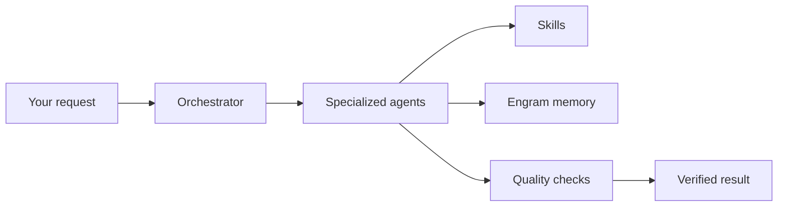
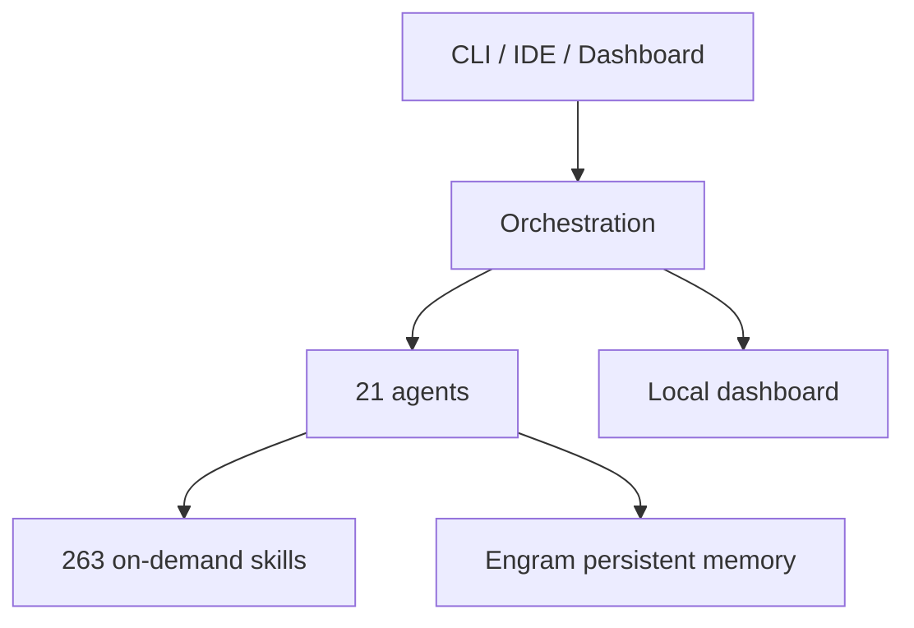
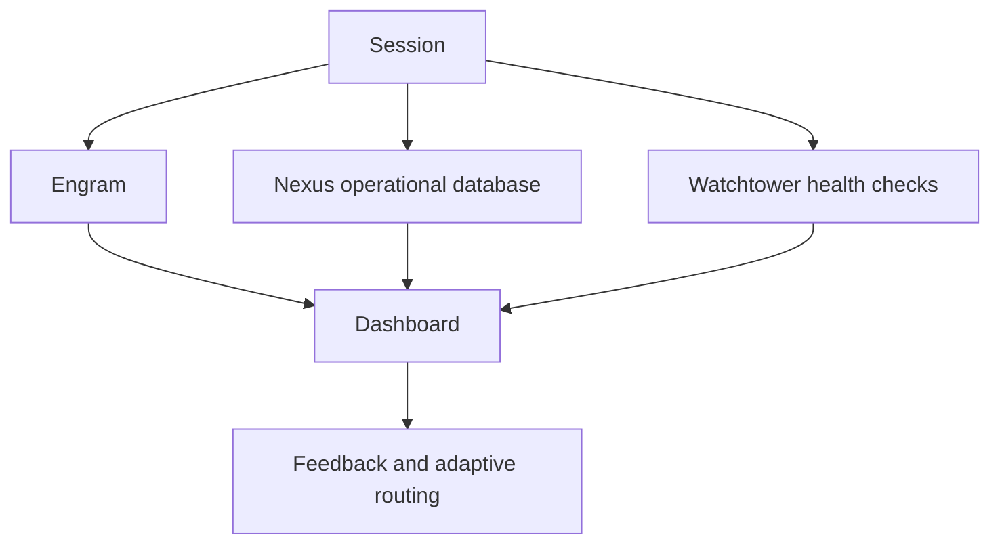

# Gentle-Vanguard

<p align="center">
  
</p>

<p align="center">
  
  
  
  
</p>

> An AI development orchestrator that adds structure, memory and verification to your existing
> coding tools.

## What It Solves

AI-assisted coding is powerful, but sessions can lose context and quality can vary. Gentle-Vanguard
routes work to specialized agents, enforces an SDD workflow, remembers previous decisions through
Engram and reports what happened through a local dashboard.

It works alongside OpenCode, Claude Code, Cline, Cursor, Windsurf and Codex. It does not require a
hosted Gentle-Vanguard account or a mandatory cloud service.

## Quick Install

```bash
git clone https://github.com/EmmanuelOrtiz87/gentle-vanguard-public.git
cd gentle-vanguard-public
pnpm install
npx tsx src/setup-complete.ts
npm run start
```

Requirements: Node.js 20+, pnpm 11+ and Git. Windows, macOS and Linux are supported.



## Architecture

Gentle-Vanguard is organized around five practical layers: user tools, orchestration, agents and
skills, memory, and observability.



## Agent Ecosystem

| Agent | Role |
| --- | --- |
| Orchestrator | Routes work and manages sessions |
| BA | Requirements exploration |
| SAD | Architecture and contracts |
| DEV | Implementation and refactoring |
| QA | Testing and verification |
| OPS | CI/CD and infrastructure |
| GOV | Security, compliance and audit |
| DOC | Documentation and ADRs |

Each phase can use a different Model Profile. The router and fallback chain are configurable and
local providers are optional.

## Key Features

| Feature | Description |
| --- | --- |
| Specialized Agents | 21 roles for analysis, design, coding, QA and operations |
| On-Demand Skills | 263 skills for development, security, documentation and research |
| Persistent Engram Memory | Decisions and context survive across sessions |
| Cost-Aware Model Router | Selects models by task and supports safe fallbacks |
| Dashboard | Local metrics, traces, alerts and feedback |
| Security Controls | Secret scanning, SBOM, provenance and quality gates |



## Getting Started

1. Install the prerequisites.
2. Clone this repository.
3. Run `pnpm install` and `npx tsx src/setup-complete.ts`.
4. Start with `npm run start`.
5. Run `gv verify` if the command is available, or `npm run watchtower:health`.

## Development

```bash
npm run typecheck
npm run lint
npm test
```

The project follows Spec-Driven Development: explore, design, implement and verify.

## CI/CD Pipeline

The public distribution is checked by `gentle-vanguard-quality-gate`, `test-suite`, `security.yml`
and `sync-public`. The public repository receives a curated set of build, documentation and example
files from the development repository.

## Defensive Patterns

- Scripts resolve paths from `repoRoot`.
- File operations use explicit UTF-8 encoding.
- PowerShell scripts use `ErrorActionPreference = Stop`.
- Setup and validation commands are designed to be idempotent.

## Security

Never commit API keys. Use environment variables or ignored local configuration. Secret scanning,
SBOM generation and release provenance are part of the delivery process. See
[`SECURITY.md`](SECURITY.md) and [`docs/security/README.md`](docs/security/README.md).

## Documentation

| Resource | Description |
| --- | --- |
| [Getting Started](docs/getting-started/README.md) | First-time setup |
| [Architecture](docs/technical/STACK-DOCUMENTATION.md) | Detailed technical reference |
| [Installation](docs/getting-started/installation.md) | Installation options |
| [Examples](docs/EXAMPLES.md) | Usage examples |
| [Changelog](CHANGELOG.md) | Version history |

## License

MIT © 2026 Emmanuel Ortiz
