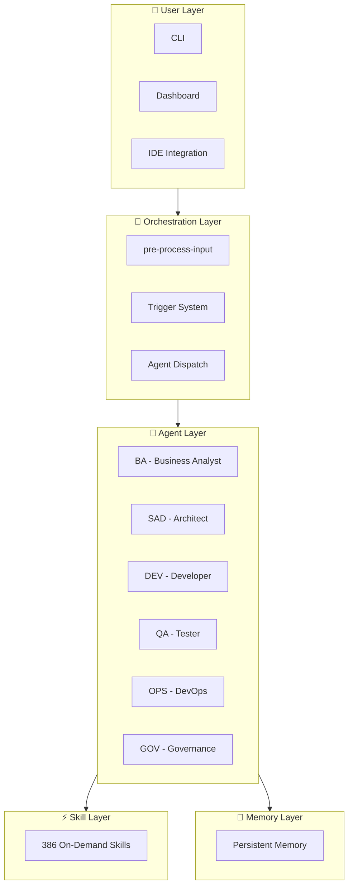

<p align="center">
  
</p>

<p align="center">
  
  
  
  
  
  
  
</p>

<p align="center">
  <a href="https://github.com/EmmanuelOrtiz87/gentle-vanguard-public">GitHub</a>
  &nbsp;·&nbsp;
  <a href="docs/getting-started/README.md">Getting Started</a>
  &nbsp;·&nbsp;
  <a href="https://github.com/EmmanuelOrtiz87/gentle-vanguard-public/releases">Releases</a>
  &nbsp;·&nbsp;
  <a href="docs/SECURITY.md">Security</a>
</p>

<p align="center">
  <strong>AI-powered development orchestrator · 18 agents · 386 skills · 10 tool-compatible</strong><br>
  <em>Tool-agnostic · Spec-Driven Development · Persistent Memory · Built-in Security</em>
</p>

> _"Building the definitive bridge between high-end software engineering and corporate strategy."_

Born from a simple observation: AI-assisted coding works, but without structure it is chaotic.
Gentle-Vanguard gives you an orchestration layer that routes tasks to specialized agents, enforces
standards, tracks every token, and remembers what you did last session.

---

## 🎯 What It Solves

| Problem                       | How Gentle-Vanguard Solves It                              |
| ----------------------------- | ---------------------------------------------------------- |
| AI code quality varies wildly | Multi-layer validation gates catch issues before commit    |
| No session-to-session memory  | Persistent memory system recalls decisions across sessions |
| Token waste from wrong models | Cost-aware router assigns optimal model per task type      |
| Unstructured AI workflows     | SDD lifecycle enforces spec-driven development             |
| Disconnected tool sessions    | Session manager tracks context with crash recovery         |
| No AI cost visibility         | Dashboard with token trends and per-agent analytics        |
| One-size AI responses         | 18 specialized agents with role-specific profiles          |

---

## 🚀 Quick Start

```powershell
# Download latest release
# https://github.com/EmmanuelOrtiz87/gentle-vanguard-public/releases/latest

# Run
./gentle-vanguard-3.3.0.exe -Dashboard
```

Or use the portable version:

```powershell
# Extract and run
./gentle-vanguard.exe -Dashboard -Portable
```

---

## 📦 Installation

### System Requirements

| Requirement    | Minimum                                         |
| -------------- | ----------------------------------------------- |
| **OS**         | Windows 10/11, Linux (Ubuntu 22.04+), macOS 14+ |
| **PowerShell** | 7.4+                                            |
| **Memory**     | 4 GB RAM                                        |
| **Disk**       | 500 MB free                                     |

### Step-by-Step

1. Download the latest `.exe` from
   [Releases](https://github.com/EmmanuelOrtiz87/gentle-vanguard-public/releases)
2. Run the executable — the installer will set up all dependencies
3. Launch with `./gentle-vanguard-3.3.0.exe -Dashboard`
4. Open `http://localhost:3000` in your browser

---

## 🏗️ Architecture Overview



---

## ✨ What's New in v3.3.0

### 🔄 Adaptive Feedback Loop

The system now learns from your corrections in real-time:

- **Correction Capture**: Automatically detects when you modify AI-generated code
- **Pattern Detector**: Identifies recurring correction patterns across sessions
- **Smart Suggestions**: Applies learned patterns to future generations

### 📊 Session Quality Scoring

Track your session health with objective metrics:

- **Baseline Score**: 81/100 starting quality metric
- **Real-time Updates**: Score adjusts as you work
- **Trend Analysis**: See improvement over time

### 🧠 Auto Norm Learner

Automatically builds coding standards from your patterns:

- **144 Rules**: Baseline rule set for common patterns
- **Auto-discovery**: New rules added as patterns emerge
- **Team Sync**: Share rules across your organization

### 🛠️ Stability Improvements

6 critical fixes for smoother operation:

- Improved session recovery after interruptions
- Better handling of large file operations
- Enhanced memory persistence reliability
- Faster agent dispatch response times
- Reduced memory footprint
- Improved cross-platform compatibility

---

## 📚 Documentation

| Resource                                                   | Description                 |
| ---------------------------------------------------------- | --------------------------- |
| [Getting Started](docs/getting-started/README.md)          | First-time setup guide      |
| [Installation Guide](docs/getting-started/installation.md) | Detailed installation steps |
| [Stack Setup](docs/getting-started/STACK-SETUP.md)         | Full stack configuration    |
| [Changelog](CHANGELOG.md)                                  | Version history             |
| [Examples](docs/EXAMPLES.md)                               | Usage examples              |

---

## 📄 License

MIT © 2026 Emmanuel Ortiz

---

_Gentle-Vanguard v3.3.1 — Don't let your mellow hustle be faded_
