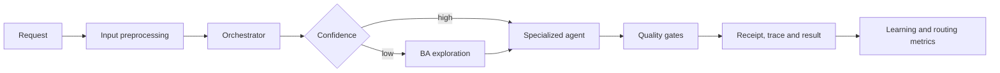
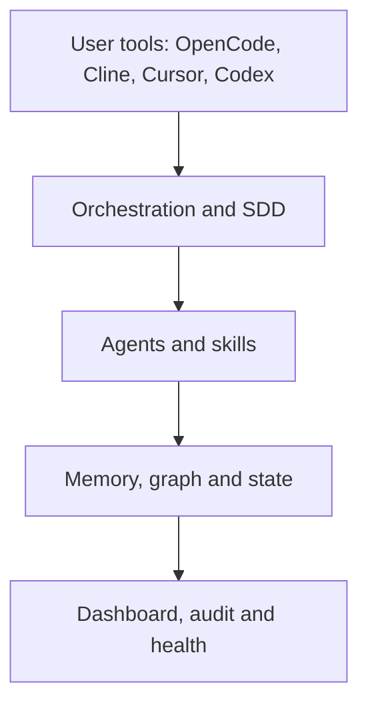
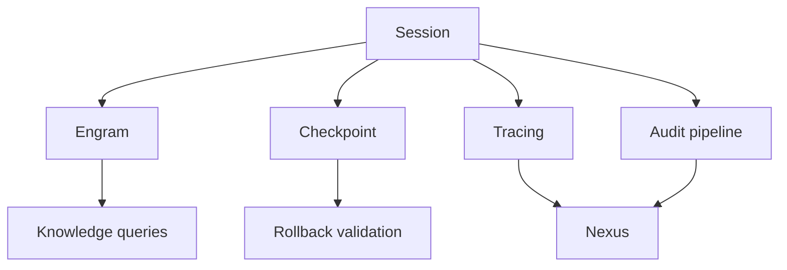

# Gentle-Vanguard: documentación técnica

Este documento amplía el [README principal](../../README.md). El README explica el propósito y el
primer uso; aquí se describen los límites, los componentes y la operación del stack.

## 1. Modelo mental

Gentle-Vanguard tiene cuatro responsabilidades:

1. **Orquestar**: clasificar una solicitud y elegir el agente o skill correcto.
2. **Conservar**: guardar decisiones, trazas, eventos y checkpoints.
3. **Verificar**: ejecutar gates de tipo, lint, tests, seguridad y salud.
4. **Aprender**: usar feedback para mejorar el routing sin modificar automáticamente código crítico.



## 2. Capas



### Orquestación

- `src/orchestrator.ts` y `src/route-and-delegate.ts` coordinan el trabajo.
- `src/recommend-agent.ts` resuelve el dominio y el agente candidato.
- `config/auto-delegation.json` contiene reglas de derivación.
- `config/model-router.json` contiene perfiles, prioridades y failover.
- `src/session-autostart.ts` inicializa la sesión y los procesos diferidos.

### SDD

El flujo recomendado es `Explore → Design → Apply → Verify`.

| Fase | Agente | Entregable |
| --- | --- | --- |
| Explore | `sdd-explore` | Alcance, preguntas y requisitos |
| Design | `sdd-design` | Arquitectura, contratos y riesgos |
| Apply | `sdd-apply` | Implementación y cambios mínimos |
| Verify | `sdd-verify` | Tests, typecheck, lint y evidencia |

Los contratos se encuentran en `config/sdd-contracts.json`. Una fase no debería asumir que la
siguiente conoce decisiones que no quedaron registradas.

## 3. Agentes y skills

Los agentes de negocio y plataforma están definidos en `opencode.json`. El archivo define agentes y
servidores MCP; no es un catálogo universal de proveedores de modelos.

La registry de skills vive en `skills/` y se consulta por triggers. Las skills deben ser cargadas
solo cuando aportan capacidad real a la tarea. Para crear una skill, respetar el frontmatter, el
contrato de activación y las pruebas correspondientes.

## 4. Memoria y estado

| Componente | Ubicación | Responsabilidad |
| --- | --- | --- |
| Engram | MCP y almacenamiento local | Memoria semántica entre sesiones |
| CodeGraph/Graphify | `.codegraph/`, `graphify-out/` | Navegación estructural del código |
| Checkpoints | `.session/checkpoints/` | Recuperación antes de cambios riesgosos |
| Snapshots | `.session/snapshots/` | Estado recuperable de mayor alcance |
| Audit | `.session/audit/` | Registro de operaciones |
| Event store | `.session/event-store/` | Eventos con cadena hash |
| Nexus | `.runtime/gentle-vanguard.db` | Métricas y datos operativos |



No se deben versionar bases locales, tokens, logs ni snapshots que puedan contener contexto privado.

## 5. Dashboard y observabilidad

El dashboard está en `apps/web-dashboard/`:

- `server/websocket-server.ts`: WebSocket y API HTTP.
- `server/real-data.ts`: transforma trazas y estado en métricas.
- `server/database/manager.ts`: singleton de Nexus y migraciones.
- `src/components/`: vistas, tracing, alertas, feedback e i18n.

Comandos:

```bash
npx tsx src/dashboard-start.ts
npx tsx src/dashboard-stop.ts
cd apps/web-dashboard && npm run build
```

El dashboard debe mostrar datos reales. Las pruebas no deben introducir mocks que parezcan métricas
de producción.

## 6. Seguridad

- Secret scanner nativo y hooks de pre-commit.
- Secretlint, Gitleaks y Trivy en CI.
- SBOM CycloneDX y provenance SLSA para releases.
- Guardrails para prompt injection y tool invocation.
- Permisos explícitos para operaciones destructivas.
- API keys únicamente por variables de entorno o archivos ignorados.

Para cambios de seguridad, consultar `docs/security/`, `rules/` y las skills de seguridad antes de
implementar.

## 7. Resiliencia autónoma

El stack es **autónomo y resiliente**: detecta fallos, toma acciones correctivas y continúa sin
intervención humana, aprendiendo de cada incidente. Tres piezas se complementan:

- **Guardrail Orchestrator** (`src/guardrail-orchestrator.ts`): punto central donde el orquestador
  consulta "¿qué hacer ante este fallo?". Clasifica fallos en 10 categorías (config, network, model,
  db, git, security, resource, reasoning, quality, unknown), decide la acción (retry, correct,
  escalate, isolate, continue, block), ejecuta delegando a los guardrails especializados y aprende
  del resultado (`.session/guardrails/incidents.jsonl`).
- **Anti-loop guard** (`src/anti-loop-guard.ts`): detecta bucles de razonamiento (misma estrategia
  fallando repetidamente) y fuerza cambio de estrategia (3 fallos) o escalación (5+).
- **Watchtower** (`src/core/maintenance-watchtower.ts`): salud y auto-healing de 96 checks / 22
  componentes.

Integración: `src/agent-delegator.ts` expone `delegateWithGuardrail()` que envuelve
`delegateWithAntiLoop()` — si la delegación falla, clasifica el fallo, registra un incidente y
devuelve la guía correctiva en vez de reintentar a ciegas.

```bash
npx tsx src/guardrail-orchestrator.ts decide "<error>"   # decisión ante un fallo
npx tsx src/guardrail-orchestrator.ts stats              # aprendizaje por categoría
```

## 8. Configuración de modelos

`opencode.json` selecciona los modelos de agentes mediante identificadores que el runtime de
OpenCode conozca. Los proveedores locales opcionales se documentan en `config/cloud-agents.json` y
las cadenas de fallback en `config/model-fallback.json`.

Actualmente no existe un proveedor Dify nativo configurado. Dify no se muestra en OpenCode solo por
agregar una entrada JSON: requiere un adaptador/proveedor compatible con la API y con tool calling.
Las antiguas configuraciones Cline/Dify fueron retiradas para no presentarlas como capacidad activa.

## 9. Operación diaria

```bash
npm run typecheck
npm run lint
npm test
npm run watchtower:health
npm run db:health
npm run graphify -- query "where is session startup implemented?"
npm run graphify -- update .
```

Si el grafo está desactualizado, actualizarlo después de cambios de código. Los archivos generados
por el autostart pueden aparecer modificados: revisar el diff y no revertirlos ciegamente.

## 10. Publicación

La estrategia de repositorios está en [`docs/REPOSITORY-PUBLICATION.md`](../REPOSITORY-PUBLICATION.md).
La publicación usa `src/sync-to-public.ts` y una allowlist. El repositorio público debe contener
instaladores, ejemplos y documentación, no el estado operativo de una máquina.

## 11. Diagnóstico rápido

| Síntoma | Comprobación |
| --- | --- |
| Dashboard no responde | `npm run watchtower:health` y revisar el puerto guardado |
| MCP no inicia | Validar `opencode.json` y ejecutar el health check MCP |
| Contexto perdido | Revisar Engram, `.session/` y el session log |
| Modelo no disponible | Revisar `config/model-router.json` y fallback |
| Graphify desactualizado | `npm run graphify -- update .` |
| Cambio no publicable | Revisar allowlist y el workflow `sync-public.yml` |

## Referencias

- [Guía de inicio](../getting-started/README.md)
- [Arquitectura](../architecture/README.md)
- [Operaciones](../operations/procedures/QUICK-COMMANDS.md)
- [Seguridad](../security/README.md)
- [ADRs](../adr/README.md)
- [Gobernanza](../governance/README.md)
